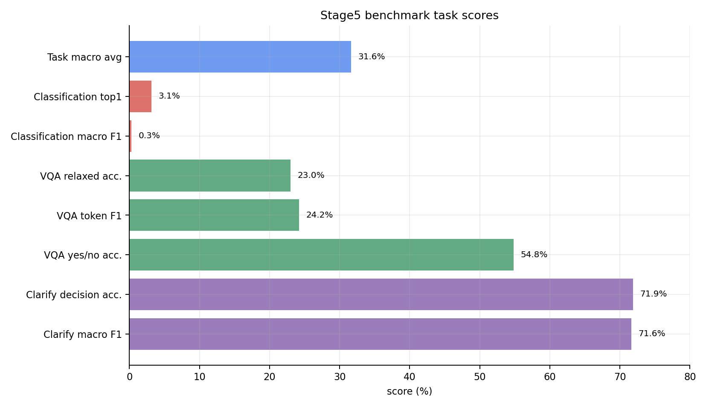
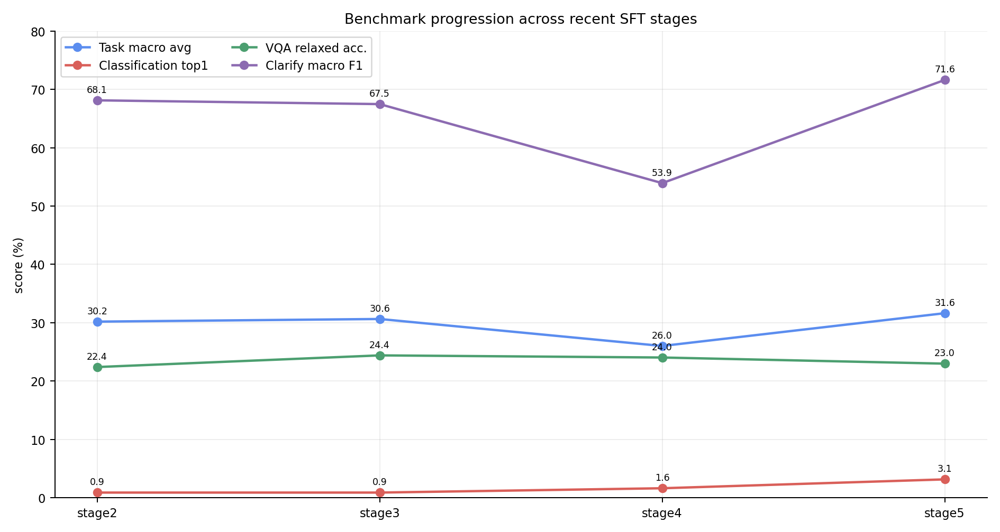
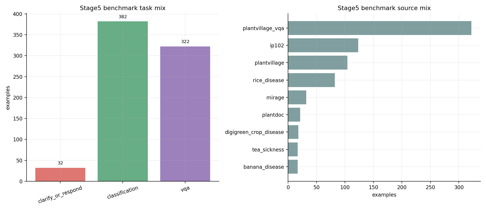
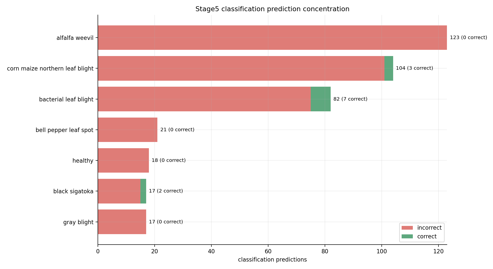
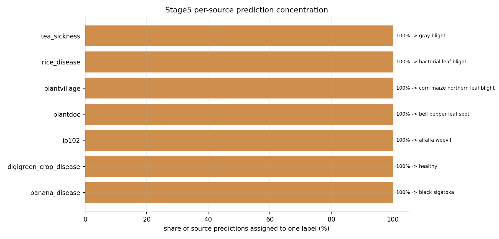
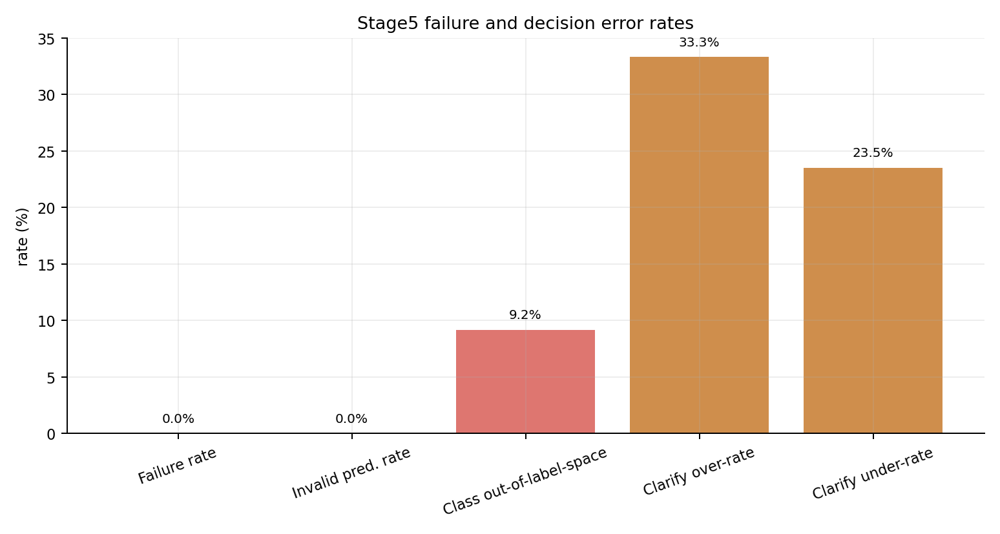
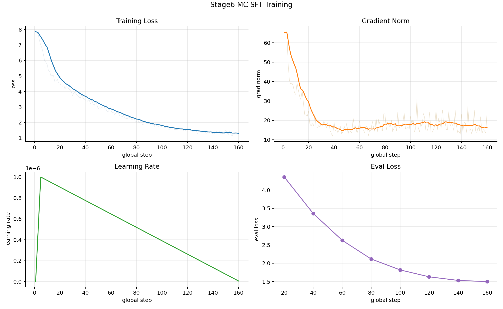
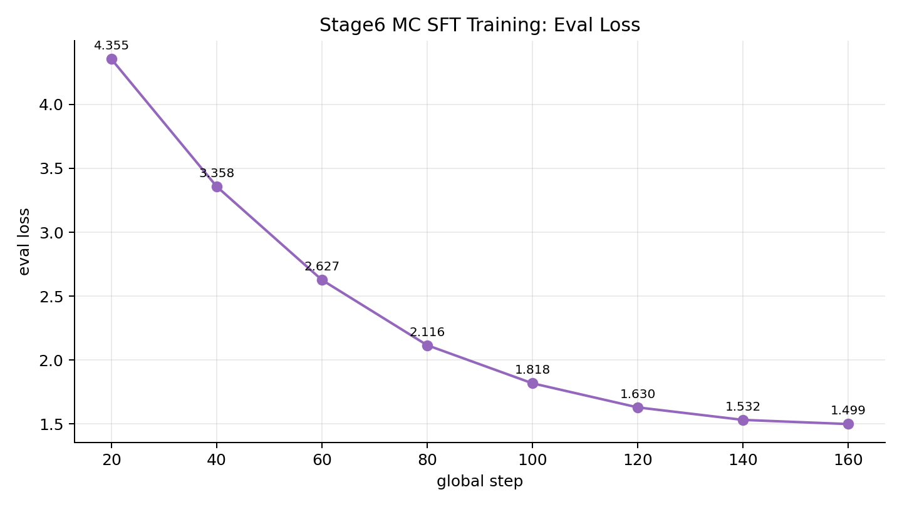

# Benchmark Report - 2026-06-07

## Scope

The newest completed training run is `stage6-mc` from 2026-06-06, but I did not find a completed benchmark artifact for that checkpoint. The newest completed benchmark artifact is the Stage5 datafix benchmark from 2026-06-04. This report uses Stage5 for benchmark metrics and includes Stage6 MC training curves as checkpoint-readiness context.

Inputs:

- Latest benchmark metrics: `benchmarks/vlm_baselines/results/agvlm_stage5_datafix_benchmark_20260604/metrics/sft-benchmark_agvlm-phi4-sft-stage5-datafix-b200-candidate_test_metrics.json`
- Latest benchmark summary: `benchmarks/vlm_baselines/results/agvlm_stage5_datafix_benchmark_20260604/metrics/summary_table.csv`
- Latest training metrics: `outputs/sft/phi4-reasoning-vision-15b-classification-probe-stage6-mc-b200-4gpu/metrics.jsonl`

## Headline

Stage5 is not promotion-ready. The benchmark aggregate improved versus Stage4, but the model is still failing the classification part of the benchmark.

Key Stage5 scores:

- Test examples: `736` total, with `382` classification, `322` VQA, and `32` clarify/respond.
- Task macro average: `31.63%`.
- Classification top1 accuracy: `3.14%`.
- Classification macro F1: `0.30%`.
- Classification out-of-label-space rate: `9.16%`.
- VQA relaxed accuracy: `22.98%`.
- VQA token F1: `24.23%`.
- Clarify decision accuracy: `71.88%`.
- Clarify macro F1: `71.63%`.

## Stage Progression

| Stage | Examples | Task macro | Classification top1 | Classification macro F1 | VQA relaxed | Clarify macro F1 |
| --- | ---: | ---: | ---: | ---: | ---: | ---: |
| Stage2 closed-label | 392 | 30.19% | 0.88% | 0.03% | 22.40% | 68.13% |
| Stage3 cls repair | 392 | 30.64% | 0.88% | 0.03% | 24.40% | 67.48% |
| Stage4 datafix | 616 | 26.01% | 1.62% | 0.07% | 24.04% | 53.93% |
| Stage5 datafix | 736 | 31.63% | 3.14% | 0.30% | 22.98% | 71.63% |

Interpretation: Stage5 recovered the aggregate mainly through clarify/respond and a small classification-top1 gain. Classification macro F1 remains effectively flat and very low, so the benchmark still shows a label-collapse failure mode.

## Data Mix

Stage5 benchmark source distribution is broad enough to expose the issue: the benchmark includes PlantVillage VQA, IP102, PlantVillage classification, rice disease, PlantDoc, DigiGreen, banana disease, tea sickness, and Mirage clarify/respond rows.

## Classification Failure Mode

The classifier predicts a small set of labels too often. Top predicted labels on the Stage5 classification split:

| Predicted label | Count | Correct |
| --- | ---: | ---: |
| `alfalfa weevil` | 123 | 0 |
| `corn maize northern leaf blight` | 104 | 3 |
| `bacterial leaf blight` | 82 | 7 |
| `bell pepper leaf spot` | 21 | 0 |
| `healthy` | 18 | 0 |
| `black sigatoka` | 17 | 2 |
| `gray blight` | 17 | 0 |

This is source-pattern collapse, not a parser failure. Invalid prediction rate is `0.00%`, and `{'exact': 347, 'out_of_label_space': 35}` shows most classification outputs parse as exact labels. The model is usually producing allowed-label-shaped answers; they are just the wrong labels.

## Stage6 MC Training Context

The Stage6 multiple-choice probe trained after this benchmark. It has no benchmark artifact yet, but its loss-only eval curve looks healthy:

- Eval loss first: `4.355119228363037`.
- Eval loss final/best: `1.4993938207626343`.
- Logged train loss first: `7.8635`.
- Logged train loss final: `1.2811`.
- Final global step: `160`.
- Final aggregate train loss: `2.6821530029177665`.

## Recommendation

Benchmark `checkpoint-160` from the Stage6 MC run before making any promotion decision. The training loss curve is encouraging, but the last completed benchmark says the current promoted candidate still fails classification badly. A useful next report should compare Stage5 against Stage6 MC on the same benchmark split and include per-source classification accuracy.

## Generated Artifacts

- Summary JSON: `benchmark_report_summary.json`
- Stage progression CSV: `tables/stage_progression.csv`
- Top classification predictions CSV: `tables/stage5_top_classification_predictions.csv`
- Source prediction modes CSV: `tables/stage5_source_prediction_modes.csv`
- Figures: `figures/*.png`
- Stage6 training plots: `stage6_mc_training_graphs/*.png`
