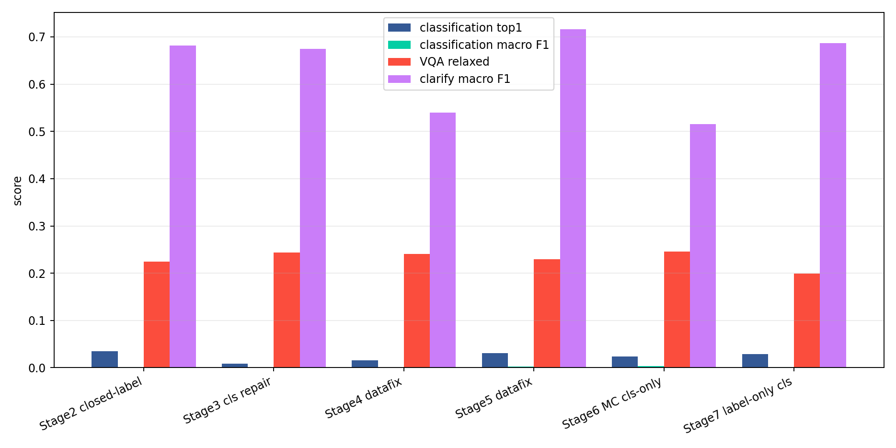
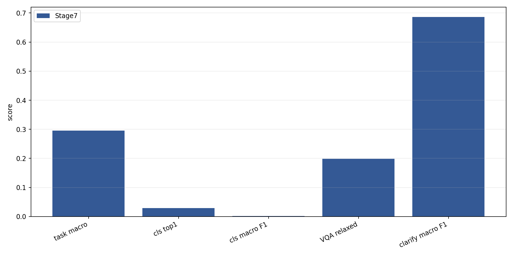
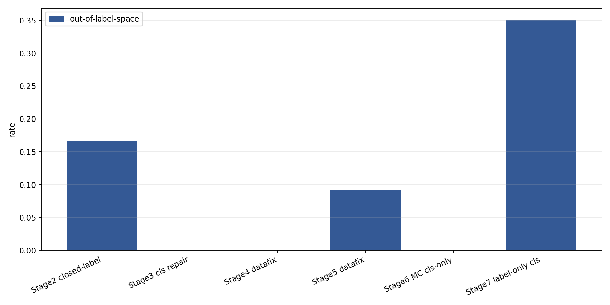
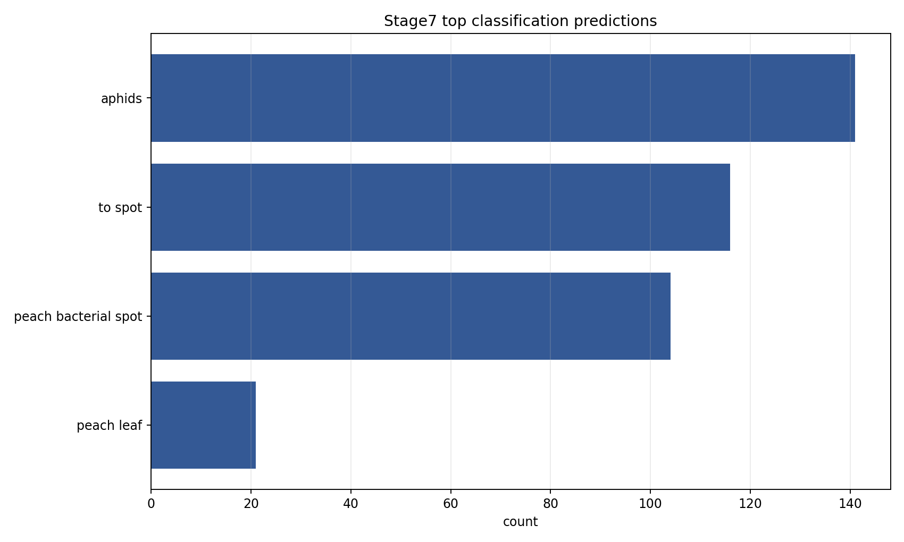
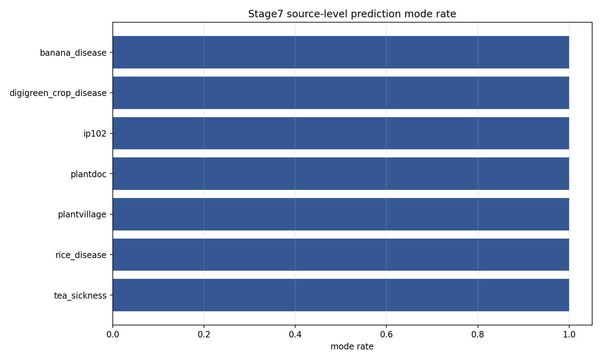
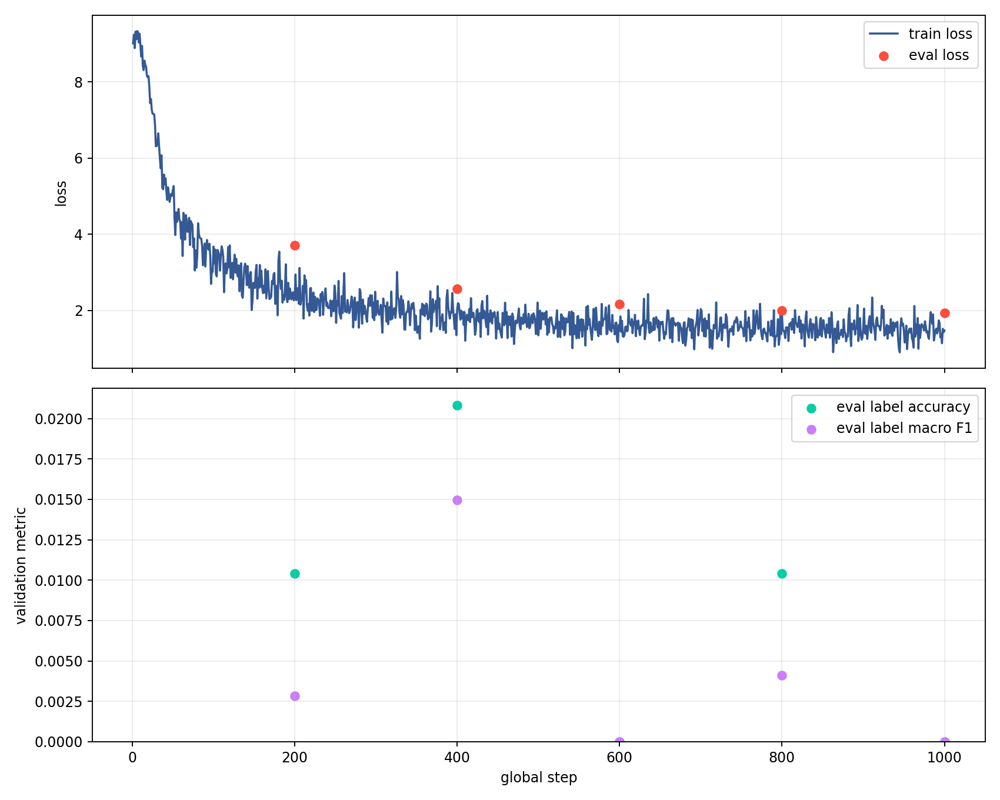

# Stage7 Label-only Classification Benchmark

Date: 2026-06-08

## Scope

Stage7 `label_only_classification` was benchmarked on the same Stage5 held-out SFT test split used by the Stage5 and Stage6 MC comparisons.

- Training job: `34071393`, completed with exit code `0:0`; full-train MaxRSS was `153049588K` under a `256G` request.
- Benchmark job: `34088628`, completed with exit code `0:0`; one GPU, `80G` request, elapsed `00:20:25`.
- Benchmark split: `benchmarks/vlm_baselines/splits_stage5_datafix/sft_test_manifest.jsonl`.
- Prediction file: `benchmarks/vlm_baselines/results/agvlm_stage7_label_only_classification_benchmark_20260607/predictions/sft-benchmark-agvlm-phi4-sft-stage7-label-only-classification-b200-candidate-test.jsonl`.
- Classification benchmark prompt used `AGRI_VLM_CLASSIFICATION_PROMPT_FORMAT=label_only`.

## Headline

Stage7 is not promotion-ready. The label-only adapter improved raw formatting for some classification rows, but did not improve semantic classification. Classification top1 is `2.88%`, macro F1 is `0.17%`, and out-of-label-space output is `35.08%`.

Compared with Stage5, classification top1 changed from `3.14%` to `2.88%`, macro F1 from `0.30%` to `0.17%`, and out-of-label-space rate from `9.16%` to `35.08%`. This is a regression, not a fix.

## Stage Comparison

| stage | examples | task macro | cls top1 | cls macro F1 | cls OOS | VQA relaxed | clarify macro F1 |
| --- | --- | --- | --- | --- | --- | --- | --- |
| Stage2 closed-label | 392 | 30.22% | 3.51% | 0.13% | 16.67% | 22.40% | 68.13% |
| Stage3 cls repair | 392 | 30.64% | 0.88% | 0.03% | 0.00% | 24.40% | 67.48% |
| Stage4 datafix | 616 | 26.01% | 1.62% | 0.07% | 0.00% | 24.04% | 53.93% |
| Stage5 datafix | 736 | 31.63% | 3.14% | 0.30% | 9.16% | 22.98% | 71.63% |
| Stage6 MC cls-only | 736 | 25.45% | 2.36% | 0.31% | 0.00% | 24.53% | 51.52% |
| Stage7 label-only cls | 736 | 29.56% | 2.88% | 0.17% | 35.08% | 19.88% | 68.63% |

## Classification Failure Mode

The failure is no longer mainly an `Answer:` wrapper mismatch. The label-only prompt causes many classification outputs to be bare strings, but the selected labels are still wrong and often outside the allowed label space.

| prediction | count | correct | OOS |
| --- | --- | --- | --- |
| aphids | 141 | 6 | 18 |
| to spot | 116 | 0 | 116 |
| peach bacterial spot | 104 | 4 | 0 |
| peach leaf | 21 | 1 | 0 |

## Source-level Modes

| source | n | mode | mode rate | accuracy | OOS |
| --- | --- | --- | --- | --- | --- |
| ip102 | 123 | aphids | 100.00% | 4.88% | 0.00% |
| plantvillage | 104 | peach bacterial spot | 100.00% | 3.85% | 0.00% |
| rice_disease | 82 | to spot | 100.00% | 0.00% | 100.00% |
| plantdoc | 21 | peach leaf | 100.00% | 4.76% | 0.00% |
| digigreen_crop_disease | 18 | aphids | 100.00% | 0.00% | 100.00% |
| banana_disease | 17 | to spot | 100.00% | 0.00% | 100.00% |
| tea_sickness | 17 | to spot | 100.00% | 0.00% | 100.00% |

## Training Curves

The final logged train loss was `1.4729` and aggregate train loss was `2.2055`, but the generated validation metric at step 1000 stayed at label accuracy `0.0000` and macro F1 `0.0000` on `96` examples. The benchmark result is consistent with that validation signal.

## Decision

- Do not promote Stage7.
- Do not launch another blind LoRA SFT round from this result.
- The next useful experiment is constrained decoding or per-source task-specific adapters with enough balanced examples per class.
- Treat label-only formatting as necessary but insufficient: it reduces wrapper mismatch but does not solve visual discrimination or label-space selection.

## Generated Artifacts

- `tables/stage_progression.csv`
- `tables/stage7_top_predictions.csv`
- `tables/stage7_source_modes.csv`
- `figures/*.png`
- Refreshed audit: `reports/eval_exact_vs_normalized.md` and `reports/error_analysis.md`
