# SFT Training Metrics Graphs

## Completed Round 1

Source metrics:

`outputs/sft/phi4-reasoning-vision-15b-full-max3-turin-16gpu-batch1/metrics.jsonl`

Summary:

- Steps: `1` to `4571`
- Final epoch: `1.0`
- Final `train_loss`: `1.3352`
- Logged loss went from `14.6309` at step 1 to `2.9700` at step 4571.
- First 100-step mean loss: `10.5037`
- Last 100-step mean loss: `3.0500`
- Eval loss decreased from `3.2955` to `2.6308` across the four logged eval points.

Main plots:

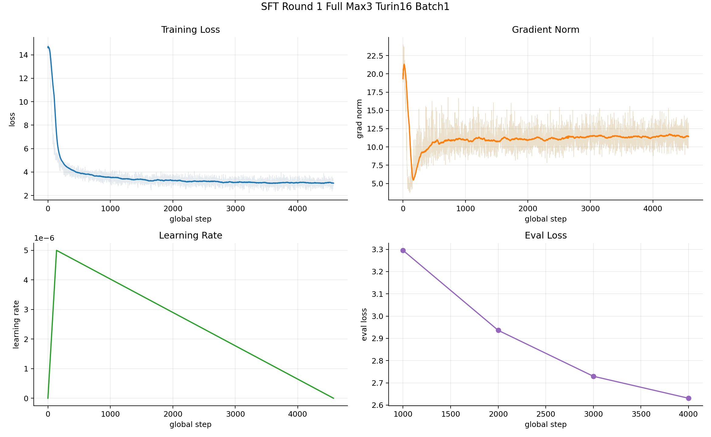

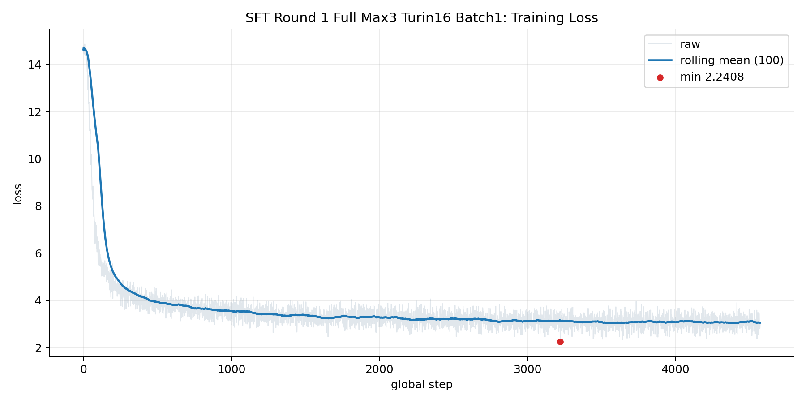

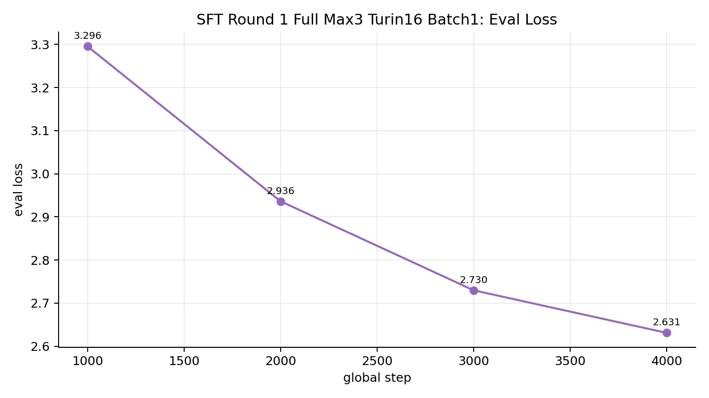

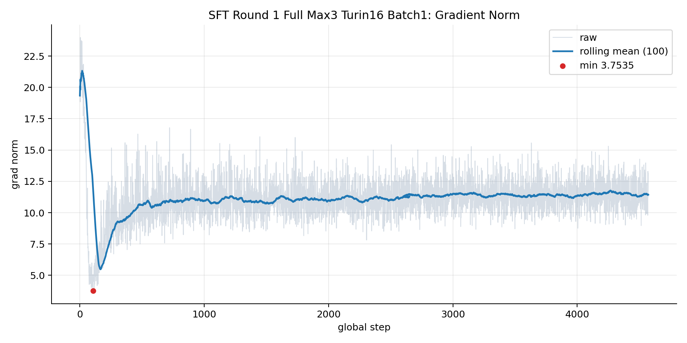

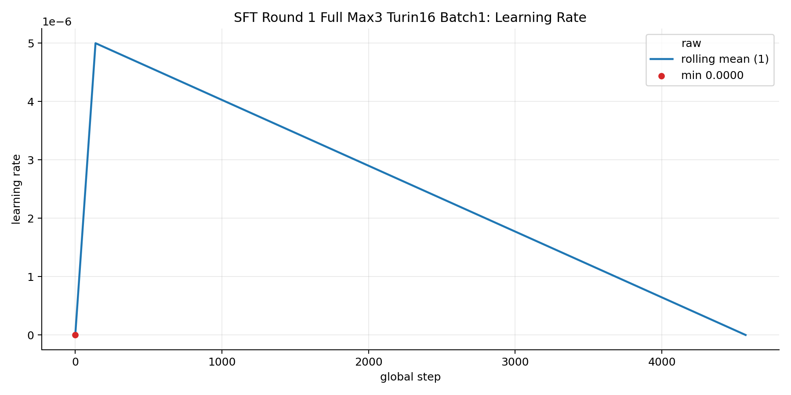

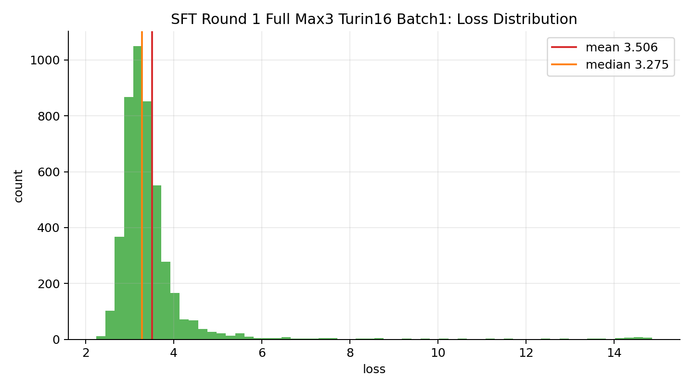

Detailed summary:

[round1_full/summary.md](round1_full/summary.md)

## Current Round 2 Early Progress

Source metrics:

`outputs/sft/phi4-reasoning-vision-15b-balanced-v2-instructional-full-turin16-batch1/metrics.jsonl`

This is only an early-progress snapshot. At graph generation time it contained 44 logged steps.

Summary:

- Steps: `1` to `44`
- Epoch range: `0.00036` to `0.01564`
- Logged loss went from `14.3479` at step 1 to `11.9456` at step 44.
- No eval loss rows had been logged yet.

Main plots:

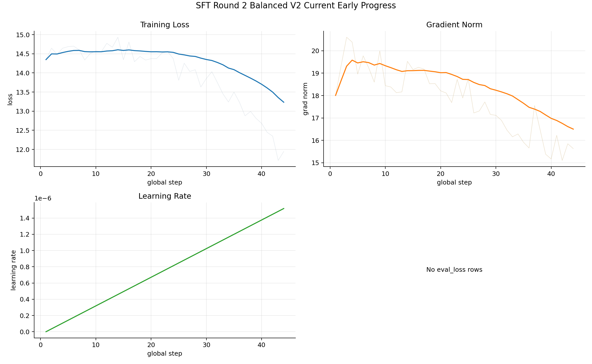

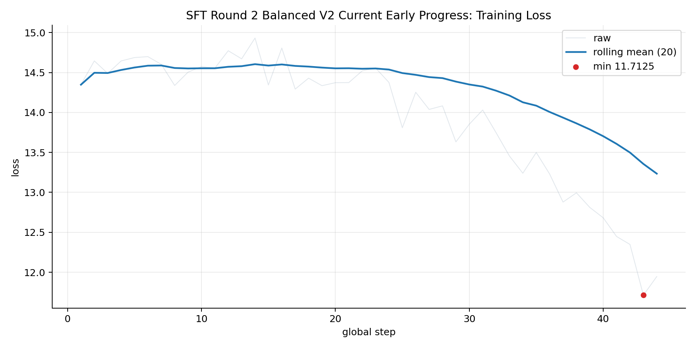

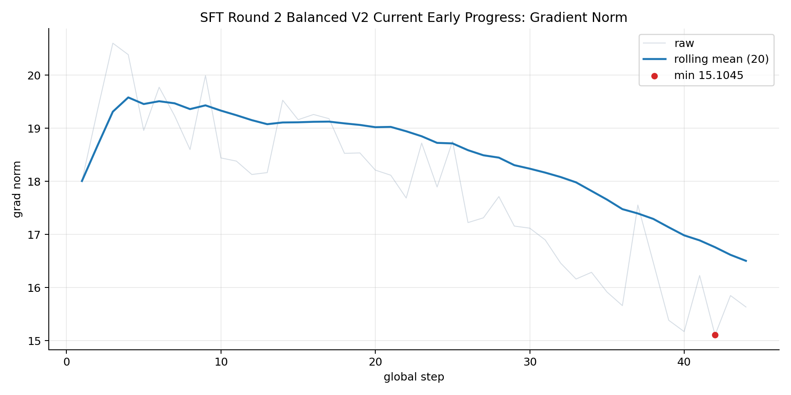

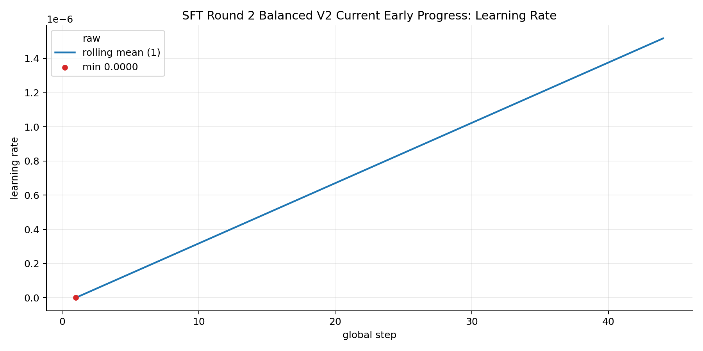

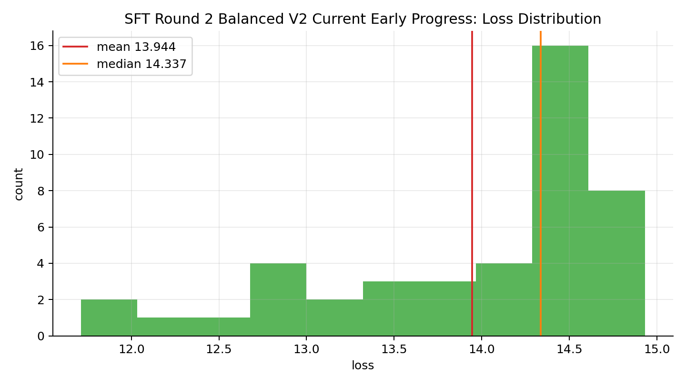

Detailed summary:

[round2_current_early/summary.md](round2_current_early/summary.md)

## Interpretation

The completed first round shows normal optimization behavior: loss falls sharply early, then flattens near the end of the epoch. That means the training loop and checkpointing worked, but it does not prove the SFT improved the model; the inference gates showed VQA regression and no clarify/respond gain.

The current second round is too early to judge from loss. Its first logged losses are high because it is still at the beginning of warmup and has a different, more instruction-heavy target format. The useful decision point will be checkpoint inference, not early training loss alone.
